# 🔒 GamingCrypt

A fullscreen **touch UI for Linux gaming handhelds** whose games live on a
**VeraCrypt-encrypted drive**. On start you unlock the drive with a **PIN,
password or swipe pattern**, and then you land in a console-style launcher with
your Steam library.

| Games | Steam library | Game page |
|---|---|---|
| 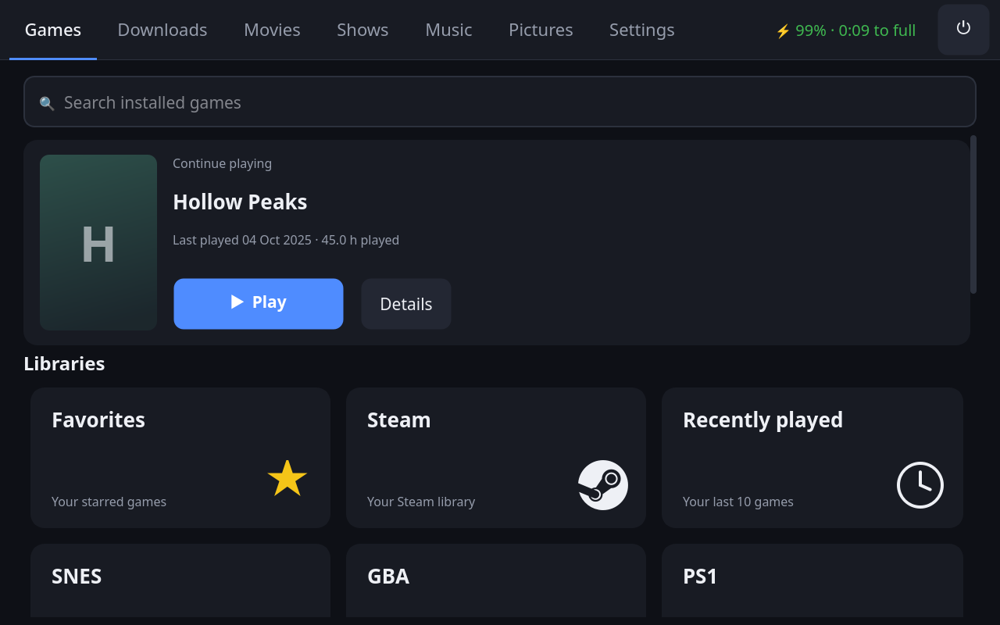 | 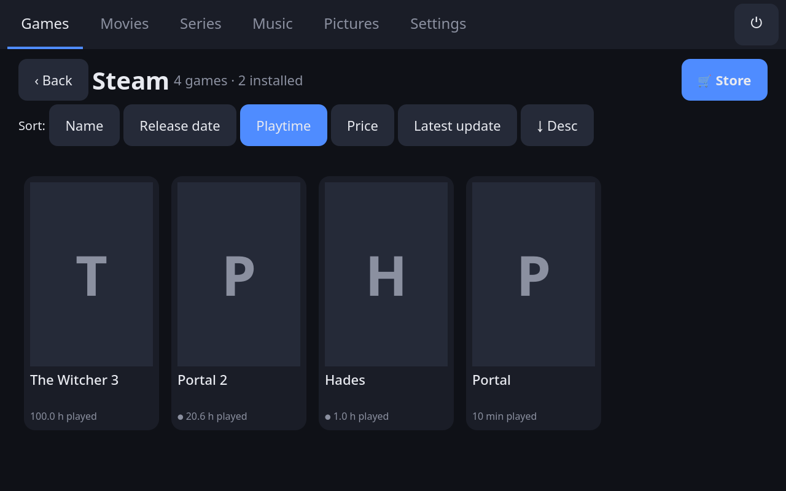 | 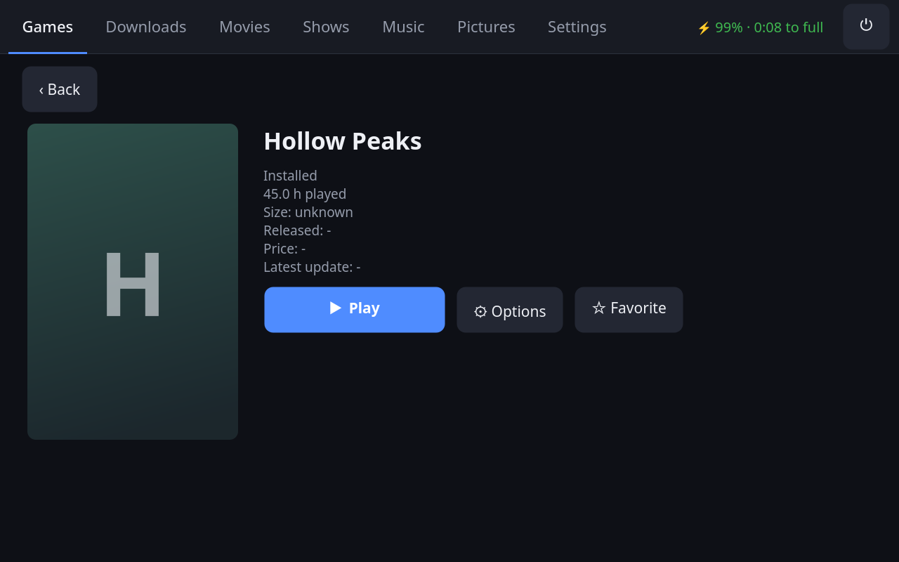 |

| Movies | Movie page | Light theme |
|---|---|---|
| 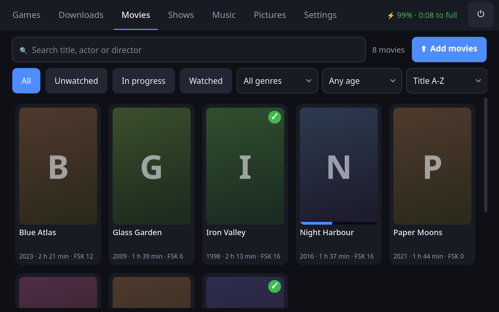 | 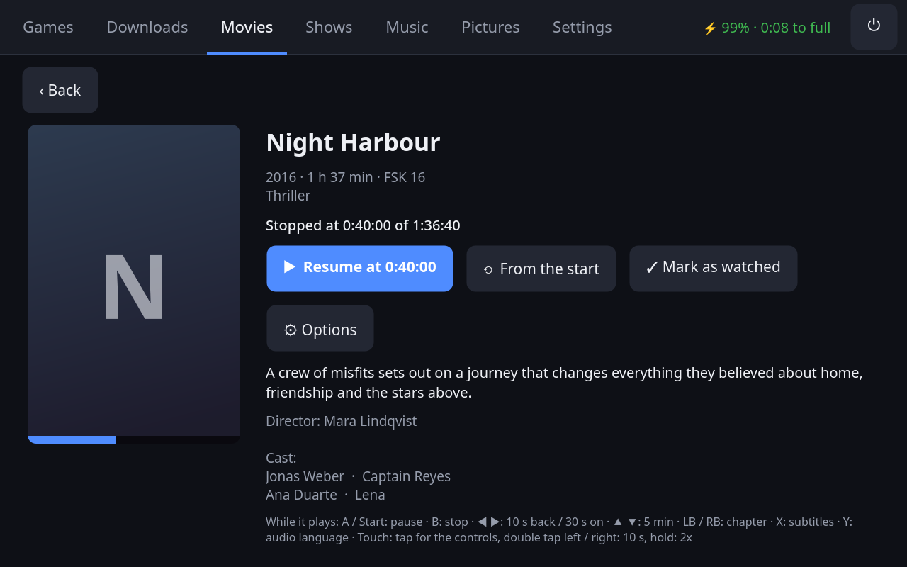 | 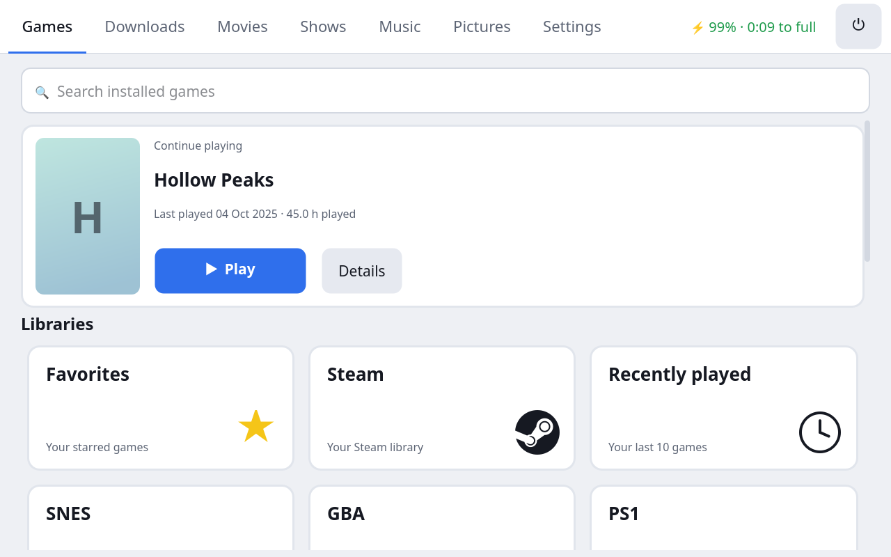 |

| Shows | Show page | Episodes |
|---|---|---|
| 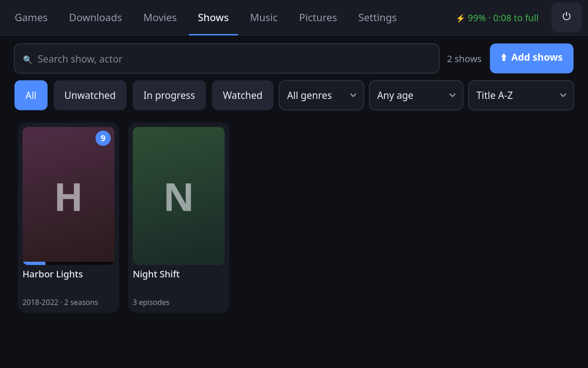 | 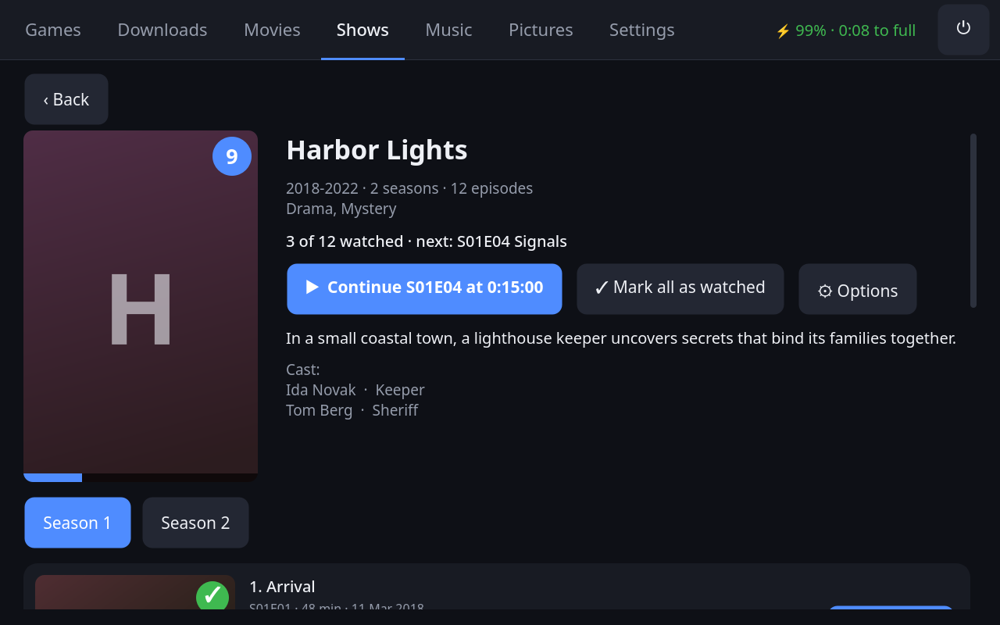 | 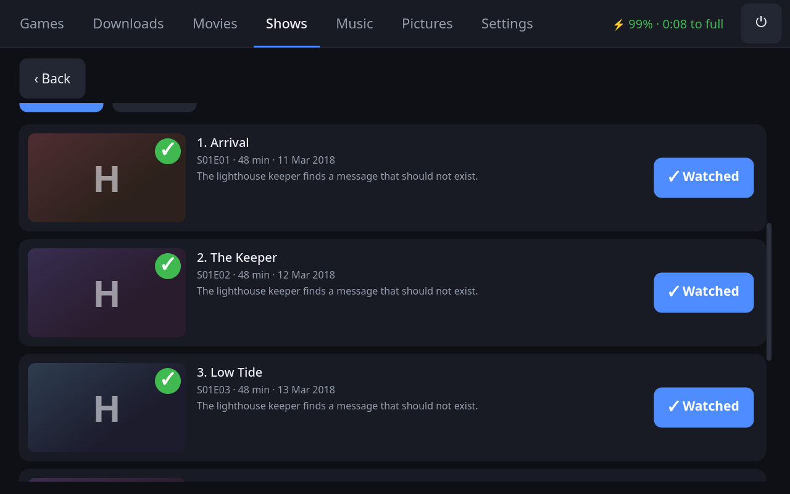 |

| Quick menu | Settings | Settings (light) |
|---|---|---|
| 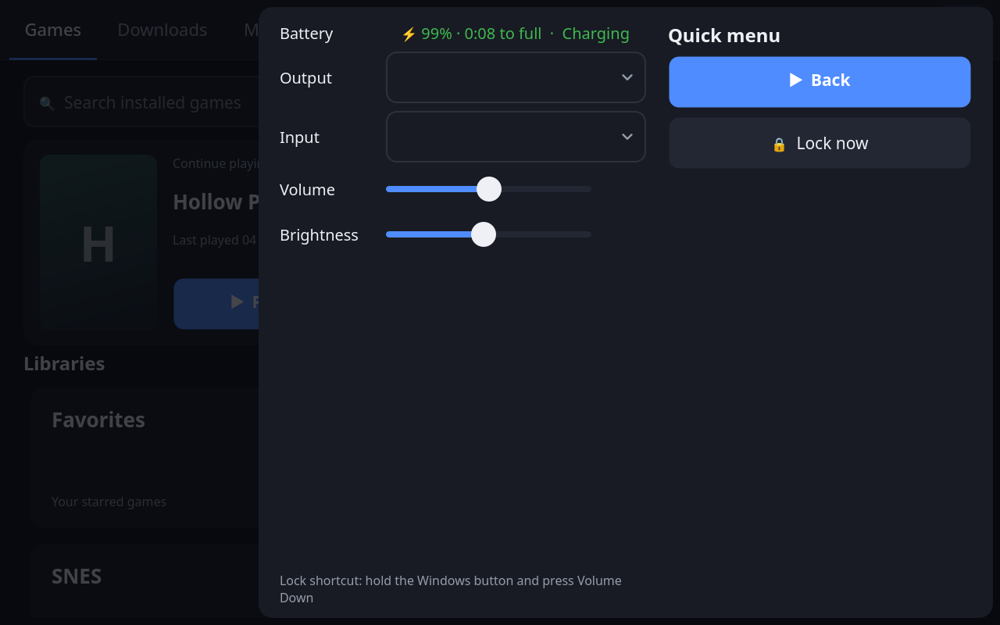 | 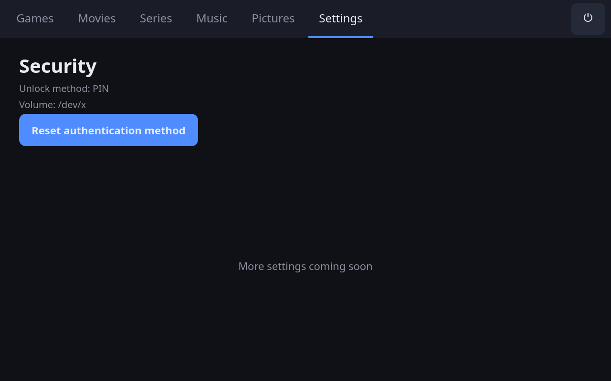 | 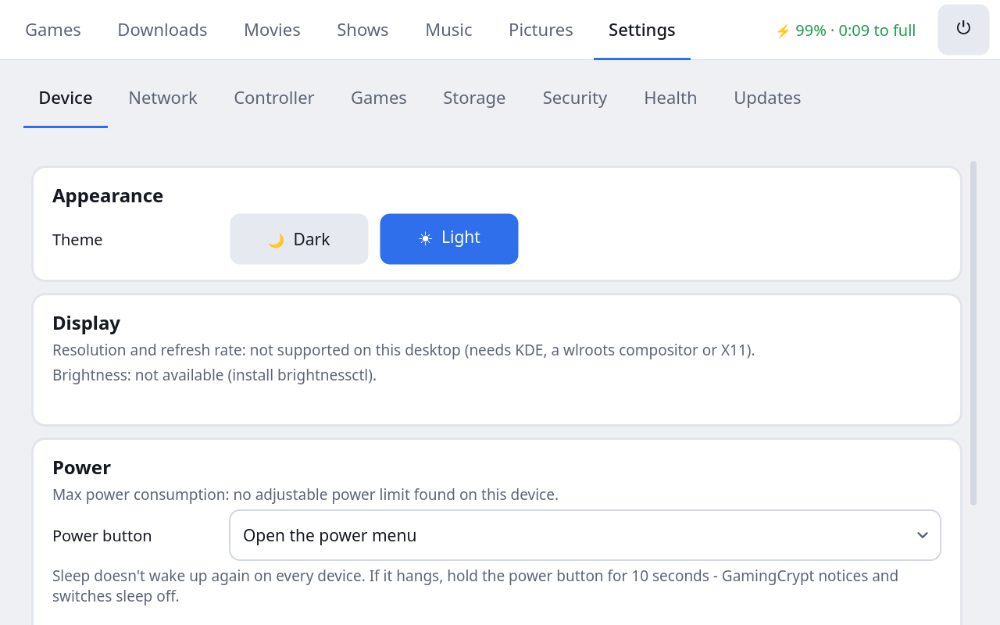 |

| Lock screen | 5×5 Pattern | Swipe pattern | First start |
|---|---|---|---|
| 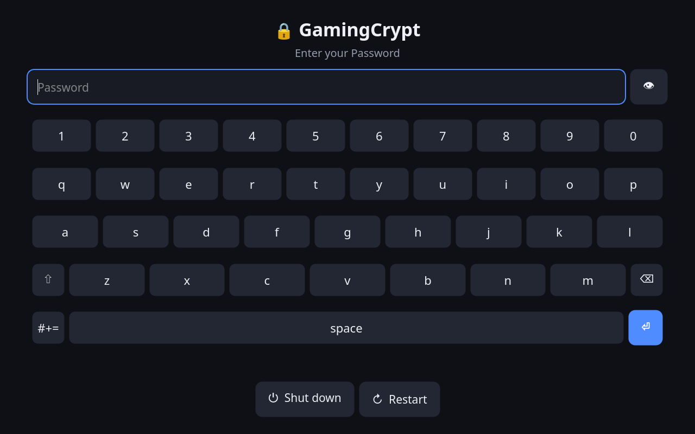 | 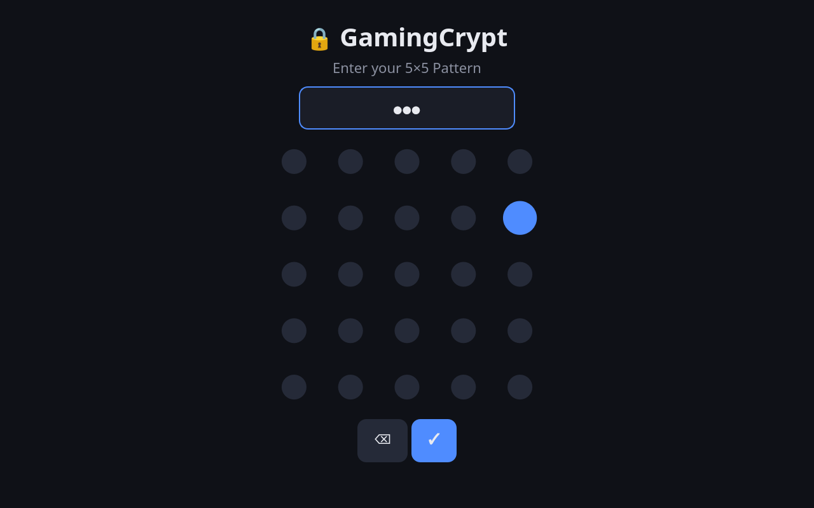 | 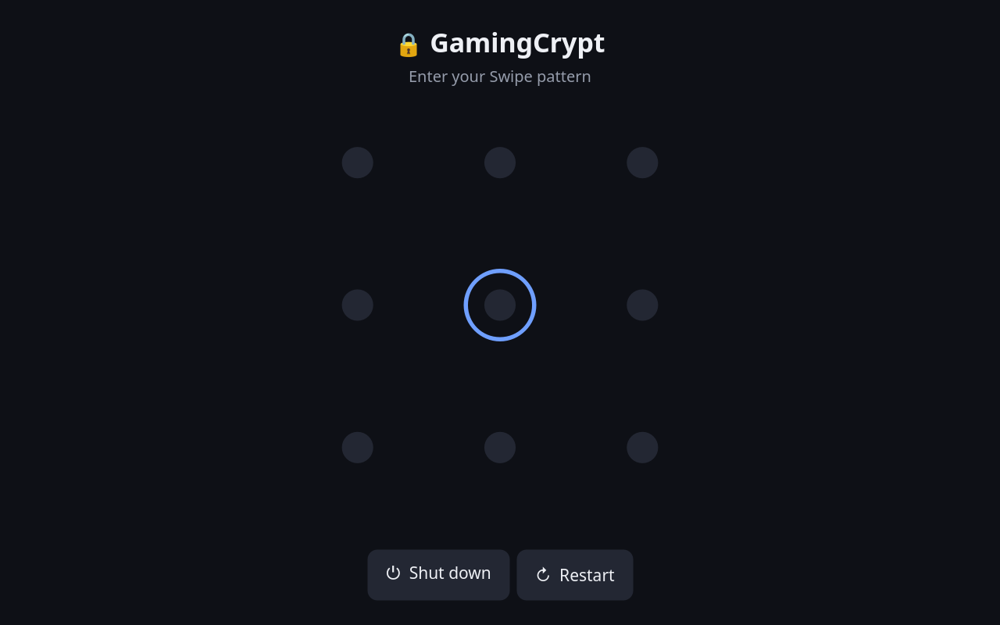 | 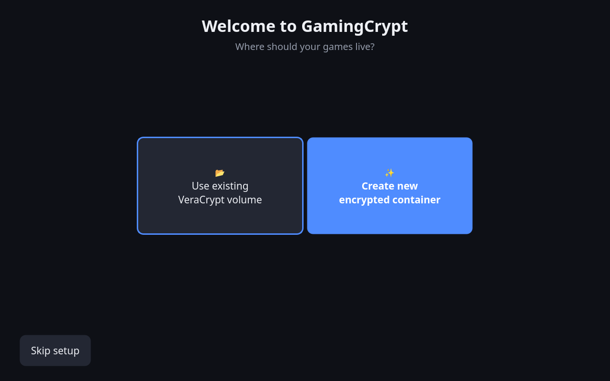 |

The screenshots are made with `.venv/bin/python docs/screenshots.py` (sample data, no device needed).

## Features

- **Unlock screen**: PIN pad, password with on-screen keyboard, a 3×3 swipe pattern, or a 5×5 tap pattern
  - Mounts your VeraCrypt volume (device or file container); the password goes to VeraCrypt over stdin
- **First-start setup**: pick an existing volume, or **create a new encrypted container**, then choose your unlock method
- **Key derivation**: every secret is hardened with scrypt and a per-volume salt before it reaches VeraCrypt
- **Settings → Reset authentication method**: switch between PIN, password, swipe pattern and 5×5 pattern at any time
- **Dark and light theme** (*Settings → Device → Appearance*), switched at once; the same clean design on every page
- **Browse with the controller like on a console**: left / right stay in their row (a grid row goes on with the
  next one), up / down keep the column, tab rows are entered at the open tab, B goes back - and everything works by touch too
- **Tabs**: Games, Downloads, Movies, Shows, Music, Pictures, Settings (Music and Pictures show *coming soon*)
- **Power menu** (⏻): lock, shut down, restart, restart into another system, desktop mode
- **Battery** next to ⏻: level, ⚡ when on external power, red when low
- **Downloads tab**: every queued, running and paused Steam download with progress and a count in the tab bar; reorder with ▲/▼ (the top one downloads), cancel with ✕ (deletes what was downloaded)
- **Device settings**: resolution, refresh rate, brightness, max power consumption (TDP), audio output and input device and their volume
- **Controller**: calibrate the analog sticks and triggers and map every button; games get a virtual Xbox controller with your setup
- **Games**
  - **Continue playing** at the top, installed games below the libraries, searchable
  - Libraries: **Favorites**, **Steam** (your whole library), **Recently played** and one per **emulated system**
  - Sort by **name, release date, playtime, price or latest update**, ascending or descending
  - **🎮 Big Picture** opens Steam's console UI (e.g. for Workshop mods); GamingCrypt steps aside and comes back when you close it
  - Game page: **Play** or **Download**, plus **Options**: Proton version, power and FPS limit, **Uninstall**
  - **Downloads without opening Steam**: owned games are queued straight onto the encrypted drive while Steam runs minimised
  - **Store**: search the Steam store, install free or owned games, or open a paid game's purchase page in Steam
- **Emulated games** (RetroArch, Eden for Switch): NES to PS2, covers from libretro-thumbnails, cores downloaded
  automatically, controls per system on a picture of its controller, save states, speed and disc switching in the
  quick menu; add ROMs and BIOS files over Wi-Fi (browser with QR code, or a network share)
  - **Shaders**: tick and combine CRT, scanlines, LCD grid, Game Boy screen, pixel-art smoothing (xBRZ, ScaleFX),
    sharp pixels, FXAA, sharpen and TV colors - per system (**✨ Shaders** next to Controls) or per game (Options),
    with a preview next to the list
- **Windows and Linux games** outside Steam: copy a game folder over the network share into `<drive>/Windows Games`
  or `<drive>/Linux Games`, pick its start file; Windows games run with any Proton (Steam's, GE-Proton …) or Wine in
  their own prefix on the drive, Linux games directly or in Steam's runtime; covers from Steam's store, play time,
  Continue, Recently played and Favorites like every other game
- **Movies**: every video in `<drive>/Movies`, with cover, description, cast, FSK rating and length from Wikidata /
  Wikipedia (saved next to the movie as `.jpg` and Kodi `.nfo`); search and filters; plays full screen in mpv with
  controller and YouTube-like touch controls (double tap to skip, hold for 2x, speed menu); resume where you stopped,
  watched marks, remove with everything that belongs to it, upload over Wi-Fi
- **Shows**: one card per show, not per episode - episodes are recognised by their names (`S01E02`, `1x02`,
  season folders) and grouped; show and episode info, pictures and cast from TVmaze; seasons, **Continue** with the
  next episode, the next one starts by itself, watched marks per episode and show
- Built for touch: big targets, kinetic flick scrolling, an on-screen keyboard and double-tap confirmation for destructive actions

## Install

Requirements: Linux, Python ≥ 3.10, [VeraCrypt](https://veracrypt.fr), Steam (native or Flatpak).

```sh
git clone https://github.com/KsmBl/gamingCrypt.git
cd gamingCrypt
./install.sh              # add --autostart to launch it after login
```

The installer:

1. creates a virtualenv in `~/.local/share/gamingcrypt` and installs the app (PySide6, requests)
2. adds the `gamingcrypt` launcher to `~/.local/bin` and a desktop entry
3. installs a **restricted root helper** and a sudoers rule so the volume can be mounted without a password prompt (asks for sudo once)
4. allows the logged-in user to create the virtual controller (`/dev/uinput` udev rule)

Uninstall with `./install.sh --uninstall` (your config and cache are kept).

Run `gamingcrypt --windowed` to try it in a window instead of fullscreen.

## Gaming mode and desktop mode

`./install.sh --session` turns the device into a console, similar to SteamOS:
- **Boot:** it goes straight into **gaming mode**, GamingCrypt on
  [gamescope](https://github.com/ValveSoftware/gamescope) (LightDM autologin). Games run
  inside gamescope, fullscreen and focused.
- **⏻ → Desktop mode:** switches to your desktop (tileWin if installed, otherwise your
  other session). Log out there, or pick *Gaming Mode* in the start menu, to come back.
- **If gaming mode keeps crashing on start** (e.g. gamescope not installed), the session
  falls back to the desktop instead of leaving a black screen.
- **Resolution and refresh rate** in gaming mode: *Settings → Device*.
  - The resolution is what games and GamingCrypt render at, upscaled to the screen.
  - The refresh rate (40–60 Hz) makes gamescope generate a matching screen mode.
  - *Apply* closes Steam and restarts gaming mode (no unlocking again). Then it asks
    **"Keep this display mode?"** and reverts by itself after **15 seconds** without an answer.
  - If gamescope can't start with the new mode at all, the session reverts at once.
  - The options are stored in `~/.config/gamingcrypt/gamescope-args`; you can also edit it by hand.
- **Desktop mode** closes Steam first: gamescope only ends when every program started in
  it has ended.
- **Windows button → quick menu**, also in the middle of a game:
  - Output and input device, volume, brightness, refresh rate.
  - **Force quit** (tap twice): ends the game's whole process tree, and what doesn't stop
    within 3 s is killed.
  - The refresh rate changes at runtime through gamescope's dynamic refresh, so the game
    keeps running. It reverts after 15 s unless you keep it.
  - gamescope shows one app at a time: while the menu is open the game runs on behind
    GamingCrypt, and *Back to the game*, B or the Windows button returns to it.
- **Volume buttons:** gamescope doesn't handle them, so GamingCrypt does in gaming mode.
  - It reads them straight from the device, so they also work during games: 5 % steps up to
    100 %, mute toggles, and a small indicator appears while GamingCrypt is on screen.
  - `install.sh --session` gives the logged-in user read access to exactly the built-in
    devices that have volume buttons and lists them.
  - On many handhelds that's the internal "AT Translated Set 2 keyboard", which programs in
    your session can then read too. A handheld has no physical keyboard for typing.

Needs `gamescope` and the X11 libraries Qt uses inside it (Arch: `sudo pacman -S gamescope xcb-util-cursor xcb-util-image`); `install.sh --session` lists anything missing.
`./install.sh --uninstall` removes the session and the autologin setting again.

## Unlock methods and key derivation

What you enter is first turned into a canonical secret:

| Method | Secret |
|---|---|
| PIN | the digits, e.g. `482916` (at least 4) |
| Password | the text as typed |
| Swipe pattern | the touched dots numbered 1–9 row by row, e.g. an "L" `1→4→7→8→9` = `14789` |
| 5×5 Pattern | the tapped dots numbered 1–25 row by row **in tap order**, joined with `-`, repeats allowed, e.g. `1-7-13-25` (at least 4 taps) |

**Every secret then goes through a key derivation function** before it reaches VeraCrypt:

```
VeraCrypt password = base64url( scrypt(secret, salt, N=2^18, r=8, p=1) )   # 43 chars
```

scrypt is memory-hard (about 256 MB and about 0.5 s per attempt), and the salt is
random per volume and new on every password change. An attacker can't take a
4-digit PIN and try it against the volume directly. Every guess costs a full scrypt
run plus VeraCrypt's own PBKDF2, and precomputed tables don't help.

> ⚠️ **Back up the salt.** It is in `~/.config/gamingcrypt/config.json` (`unlock.kdf`) and,
> for container files, in `<container>.gamingcrypt.json` next to the container. The salt
> isn't secret, but without it the volume can't be opened.
> To open the volume with plain VeraCrypt (on another PC, for example), run
> `gamingcrypt --volume-password`, enter your PIN or pattern in the format above,
> and use the printed password.
>
> A KDF makes every guess expensive, but it can't enlarge the key space. A 4-digit
> PIN still has only 10 000 possibilities. For real protection choose a long
> password, a long 5×5 pattern, or a longer PIN.

The first-start wizard and *Settings → Reset authentication method* ask for the
current secret, then for the new method and value, and re-key the volume. Volumes
set up before the KDF existed keep working: do a reset once to switch them to the KDF.

## Steam library

Installed games are read straight from Steam's library folders, including
libraries on the encrypted drive. Native, Flatpak and Snap Steam are detected
automatically.

To also list games you **own but haven't installed**, open **Settings → Steam → Set Steam API
key** and enter a [Steam Web API key](https://steamcommunity.com/dev/apikey) (any domain name
works). Your SteamID is detected from the account logged in to Steam. Without a key, only
installed games are shown, and the Steam page says so.

### Uninstalling without Steam's popup

*Options → Uninstall* (tap twice) uninstalls directly:
1. Steam is closed briefly if it's running.
2. GamingCrypt deletes the game folder, its manifest, workshop items, shader cache and
   unfinished downloads.
3. Steam is started minimised again.

- **Saves are kept:** the Proton prefix (`compatdata/<id>`), where many Windows games keep
  their save games, is not deleted.
- **Safe by design:** only the game's own folder under `steamapps/common` is ever deleted.
- **Turning it off:** `"steam": {"silent_uninstall": false}` uses Steam's dialog again.

### Playing

When you press **Play**:
1. GamingCrypt shows *Starting <game>…* while Steam and Proton prepare the game, so you
   never see the desktop in between.
2. When one of the game's processes opens the GPU, its window is about to appear.
   Shortly after, GamingCrypt steps aside, so the game is on top, windowed or not.
3. When the game exits, GamingCrypt comes back to fullscreen.

The starting screen shows what's happening right now: *Starting Steam*, *Updating … 34%*,
*Compiling shaders*, *Starting the Steam Linux Runtime*, *Starting Proton*, *Loading …*,
*Almost there*. This is worked out from Steam's state and the game's processes.

How it works:
- **Detecting the game:** Steam starts every Linux game with `SteamLaunch AppId=<id>`, so
  the game's whole process tree is visible in `/proc`.
- **Stepping aside:** GamingCrypt hides its window instead of minimising it. On Wayland an
  app can't un-minimise itself, but showing a hidden window again works.
- **Steam waiting for you:** if Steam hasn't started the game after 15 seconds, it's
  usually showing a window (license agreement, cloud-save conflict, shader processing).
  GamingCrypt steps aside so you can see and answer it.
- **Fallbacks:** if the game never starts, GamingCrypt returns after 3 minutes. *Back to
  GamingCrypt* on the start screen cancels waiting.
- **Troubleshooting:** what happened is logged to `~/.cache/gamingcrypt/gamingcrypt.log`.

### Proton per game

*Options → Proton* on a game page lists every installed Proton and *Default (Steam decides)*:
- **Official builds:** Experimental, Hotfix, 9.0, 8.0, …, also from libraries on the encrypted drive.
- **Custom builds** from `compatibilitytools.d`, such as GE-Proton.

The choice is written to Steam's `config/config.vdf` (`CompatToolMapping`), just as Steam's
own "Force the use of a specific compatibility tool" does. Steam rewrites that file when it
exits, so it is closed briefly and started again minimised.

### Download queue

In the Downloads tab, ▲/▼ change the order. Only the download at the top runs, the others
show *Waiting*:
- **How:** GamingCrypt marks every other download as paused in Steam's app manifest and
  restarts Steam minimised. Steam only reads those files on start-up. Partially downloaded
  data is kept.
- **Next in line:** when the top one finishes, the next one starts automatically.
- **During a game:** Steam is never restarted while a game runs.
- **Safety limit:** if Steam doesn't follow the order, GamingCrypt says so instead of
  restarting it over and over.

**✕ Cancel** (tap twice):
- **New install:** stops it and deletes everything downloaded so far.
- **Update:** only the partial update data is deleted. The installed game stays, and the
  update stays paused until you move it to the top again.

### Steam windows

Some things still need a Steam window: buying, the first install of a free game, and
Steam's login. GamingCrypt minimises itself when it opens one, so the Steam window isn't
hidden behind it. Start GamingCrypt again (launcher icon or `gamingcrypt`) to bring it
back.

**Only one GamingCrypt at a time:** a lock file (`~/.cache/gamingcrypt/instance.lock`) is
taken atomically when GamingCrypt starts and held until it exits. A second start, even at
the same moment, only brings the running copy to the front and quits. Two copies would
fight over the controller, Steam and the volume.

### Several Steam accounts

If more than one Steam account has logged in on the device, *Settings → Steam* lists them all
with a **Switch** button:
1. GamingCrypt closes Steam.
2. It sets that account as Steam's auto-login account (`registry.vdf` and `loginusers.vdf`).
3. It starts Steam minimised again.

Notes:
- Switching skips the password prompt only if *Remember password* was ticked when that
  account logged in. Otherwise Steam asks once.
- The Steam page shows which account you're looking at. Owned games, the offline cache and
  playtime always belong to the active account.
- The API key works for any account whose game list is public. A private account only works
  with its own key.

If the library looks wrong, run `gamingcrypt --diagnose`. It prints:
- which Steam folder was found and every library folder in it, with its number of games
- whether the encrypted drive is mounted
- the detected account and whether an API key is set

### Encrypted drive as Steam library

After every unlock GamingCrypt checks that the mounted container is a Steam library folder.
If it isn't, it creates `steamapps` inside the container and adds the folder to Steam's
`libraryfolders.vdf` (both `config/` and `steamapps/`), labelled *GamingCrypt*:
- Steam rewrites these files when it exits, so a running Steam is closed first.
- Nothing is done unless the container is really mounted, so no game folder ever ends up
  on the unencrypted disk.
- Turn it off with `"steam": {"auto_library": false}`.

### Installing without opening Steam

**Download** (game page) and **Install** (store, for games you own) don't open Steam's install dialog:
1. GamingCrypt writes an install manifest (`appmanifest_<id>.acf`, *update required*) into the
   encrypted library, or into Steam's own folder if the drive isn't mounted.
2. It restarts Steam minimised (`steam -silent`); Steam picks up the manifest and downloads in the background.
3. The game page shows the progress and switches to **Play** when it's done.

Notes:
- Steam is restarted for this, so don't start a download while a game is running.
- Steam itself must be logged in.
- Free games that aren't in your account yet still go through Steam's dialog once,
  because that's what adds them to your account.
- Turn it off with `"steam": {"silent_install": false}` to always use Steam's dialog.

Prices, release dates and latest-update dates come from the public store API.
They load in the background, stay within Steam's rate limits, and are cached in
`~/.cache/gamingcrypt`. Play, download, uninstall and store actions go through
the Steam client (`steam://` URIs).

## Device settings

*Settings* controls the handheld itself. Each part picks the tool it finds and says
so when something isn't available:

| Setting | Uses |
|---|---|
| Resolution, refresh rate | `kscreen-doctor` (KDE), `wlr-randr` (Sway, Hyprland, other wlroots), `xrandr` (X11) |
| Brightness | `brightnessctl` (never below 5 %) |
| Max power (TDP) | AMD `power1_cap` (+ `ryzenadj` if installed) or Intel RAPL, set through the root helper |
| Audio output / input + volume | `pactl` (PipeWire or PulseAudio); switching also moves sound that's already playing |

- **New display mode:** has to be confirmed within 15 s, otherwise it reverts, like on a
  desktop. A mode that turns the screen black can't lock you out.
- **Power limit:** only values inside the range the hardware reports are accepted, and
  the root helper checks that again.
- **After a reboot:** the resolution and power limit you chose are re-applied when
  GamingCrypt starts.
- **Not supported:** gamescope (Steam's game mode) and GNOME can't be controlled this way yet.

## Browsing with the controller

| Input | Action |
|---|---|
| D-pad / left stick | move the highlight to the nearest item in that direction (hold to repeat) |
| A | select: press a button, open a game, open a dropdown, open the keyboard on a text field |
| B | back: previous page, close the keyboard, close a dropdown, cancel the loading screen |
| LB / RB | previous / next top tab |
| Start | confirm a swipe pattern |

Notes:
- **Sliders:** left and right change their value.
- **On-screen keyboard:** browse its keys with the D-pad and type with A. The pop-up keyboard
  of search fields closes with B, with a tap anywhere else, or when the highlight moves
  away from it.
- **Lock screen:** the PIN pad and the 5×5 pattern work with D-pad and A. For the swipe
  pattern, A adds the dot under the cursor, Start confirms and B clears.
- **Your mapping applies to the UI too:** GamingCrypt reads the controller through it, or
  through the virtual controller when that's on.
- **When it's paused:** while you remap buttons or calibrate, and while a game is running.

## Controller: calibration and button mapping

*Settings → Controller* shows both sticks live: the raw position (grey) and what games
will get (blue).

**Calibrate sticks and triggers:**
1. Leave everything untouched. GamingCrypt measures the resting position and the noise,
   which sets the deadzone.
2. Rotate both sticks in full circles and press both triggers fully, which measures the
   range. You can still fine-tune the deadzone with a slider afterwards.

**Buttons:** tap *Remap* next to any button, D-pad direction or trigger, then press the
button (or push the stick or trigger) that should act as it. *Reset to defaults* undoes everything.

**Use my calibration and mapping** turns on the virtual controller:
- GamingCrypt takes the built-in controller exclusively and publishes a virtual Xbox 360
  controller (`uinput`) that Steam and every game understand.
- Profiles are stored per controller model.
- If Steam reads the built-in controller directly and inputs arrive twice, turn off Steam
  Input for it.
- `install.sh` allows the logged-in user to use `/dev/uinput`.

The controller code needs no compiled libraries (pure Python on the kernel's evdev and
uinput interfaces), so it also runs on read-only systems like SteamOS.

## Configuration

`~/.config/gamingcrypt/config.json` (created by the setup wizard):

| Key | Meaning |
|---|---|
| `fullscreen` | start in fullscreen (default `true`) |
| `unlock.method` | `pin`, `password`, `pattern` (3×3 swipe) or `grid5` (5×5 tap) |
| `unlock.volume` | VeraCrypt volume, e.g. `/dev/nvme0n1p3` or `~/games.vc` |
| `unlock.mount_point` | optional, e.g. `/mnt/games` (empty = VeraCrypt picks one) |
| `unlock.use_sudo` | mount through `sudo -n` + helper (default `true`) |
| `unlock.pim`, `unlock.keyfiles` | VeraCrypt PIM / keyfiles if your volume uses them |
| `unlock.kdf` | scrypt parameters and salt (written by the setup, **back it up**) |
| `steam.root` | Steam directory (empty = auto-detect, Flatpak included) |
| `steam.api_key` | Web API key for the full library (set it in Settings → Steam) |
| `steam.steam_id` | optional, overrides the detected SteamID64 |
| `steam.command` | command used for `steam://` URIs (empty = auto-detect) |
| `steam.auto_library` | add the unlocked container as Steam library (default `true`) |
| `system.display`, `system.power_limit_w` | display mode and power limit restored at start (set from Settings) |
| `input.enabled`, `input.profiles` | virtual controller on/off, mapping and calibration per controller (set from Settings) |
| `steam.silent_install` | download owned games without Steam's dialog (default `true`) |
| `steam.silent_uninstall` | uninstall without Steam's confirmation popup (default `true`) |

## Security notes

- The password is sent to VeraCrypt over **stdin**, so it never shows up in the process list. VeraCrypt has no stdin option for the *new* password when you change it, so during a password change (a few seconds) the new secret is briefly visible in the process list.
- sudo access is **not** granted to `veracrypt` itself, because that would amount to root access. It goes only to `/usr/local/lib/gamingcrypt/veracrypt-helper`, which:
  - accepts only mount, list, change-password and create, each with a fixed set of arguments
  - always mounts with `nosuid,nodev`
  - only allows mount points below `/mnt`, `/media`, `/run/media` or your home directory
  - sets the **power limit** only within the range the hardware reports
  - only **creates** new container *files* (never devices): the file must not exist yet, and the folder must belong to you and be below those same locations. Afterwards the container file and its fresh ext4 filesystem are handed over to your user so Steam can install into it
- After updating GamingCrypt, re-run `./install.sh` so the helper is updated too.

## Creating a new container

In the first-start setup choose **Create new encrypted container** and enter:
- the file location (default `~/GamingCrypt.vc`)
- the size in GB (free space is checked)
- the mount point (default `~/GamingCrypt`)
- quick format: on by default, fast. Turn it off for a full format, which is slow but also hides how much of the container is used.

Then pick your unlock method. The container is created as AES / SHA-512 / ext4 with
your KDF-derived password, and progress is shown live. While it is being created you can
only **cancel**. Cancelling (or closing the window) stops VeraCrypt, deletes the
unfinished file and takes you back to the form.

Next to the container GamingCrypt writes `<container>.gamingcrypt.json` with the unlock
method, mount point and KDF salt. None of these are secret. On start, an existing
container (the configured one, or `~/GamingCrypt.vc`) is recognised and you go straight
to the unlock screen. *Create new container* is never offered while a container exists.
If a container has no such file (one made with VeraCrypt directly, for example), setup
asks for its current password right away.

If the configured volume is gone (container deleted, drive not connected), GamingCrypt
opens the setup instead of the unlock screen and says which volume is missing. Your old
settings are only replaced once a new setup is finished, so reconnecting the drive and
restarting gets you back to the unlock screen. After you unlock it,
GamingCrypt **adds it to Steam as a library folder automatically**.

To encrypt a whole partition or SD card, create the volume with VeraCrypt itself
and choose *Use existing VeraCrypt volume*.

## Development

```sh
python -m venv --system-site-packages .venv
.venv/bin/pip install -e '.[test]'
QT_QPA_PLATFORM=offscreen .venv/bin/pytest
```

The test suite covers the unlock backend (including a real VeraCrypt re-key
round trip when `veracrypt` is installed), the root helper, the Steam parsers
and API clients, sorting, and every UI page via pytest-qt.
`RUN_INSTALL_TEST=1` also runs a full user install of `install.sh` into a temporary HOME.

## Roadmap

- More game sources (Heroic/Epic/GOG, Lutris, emulators)
- Movies, Shows, Music, Pictures
- Navigating the GamingCrypt UI with the gamepad
- More settings

## License

MIT
